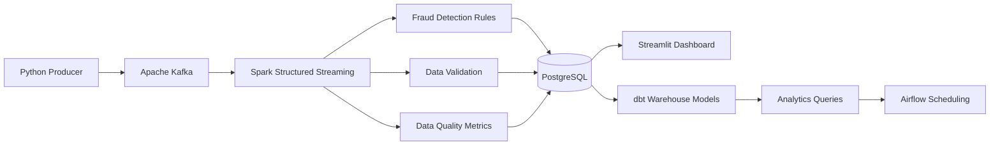
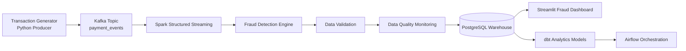
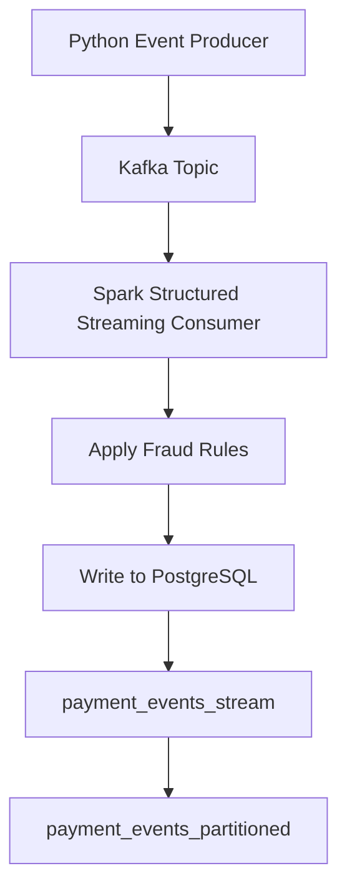
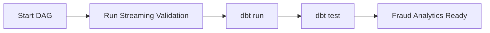

# Real-Time FinTech Fraud Detection Pipeline

This project simulates a real-time financial transaction system and demonstrates how a modern data platform processes and analyzes streaming payment events.

Transactions are generated continuously, streamed through Apache Kafka, processed using Spark Structured Streaming, and stored in PostgreSQL for downstream analytics and fraud monitoring.

The platform also includes Airflow orchestration, dbt data modeling, and a fraud analytics layer.

---

# System Overview

This pipeline represents a simplified version of how fintech platforms monitor transaction risk in real time.

Key components:

- streaming event ingestion
- real-time data processing
- fraud detection rules
- analytical data warehouse
- pipeline orchestration

---

## Architecture


---

## Streaming Pipeline Flow


---

## Tech Stack

### Streaming Infrastructure
- Apache Kafka
- Apache Spark Structured Streaming

### Data Processing
- Python
- PySpark
- Streaming ETL
- Fraud detection rules engine

### Data Storage
- PostgreSQL
- Partitioned streaming tables
- Analytical warehouse schema

### Data Modeling
- dbt (data build tool)

### Monitoring & Observability
- Streamlit dashboard
- Streaming metrics monitoring
- Data quality monitoring
- Fraud alert system

### Workflow Orchestration
- Apache Airflow

### Infrastructure
- Docker
- Containerized data platform
---

## Pipeline Features

- Real-time payment event ingestion via Kafka
- Streaming fraud detection using Spark Structured Streaming
- Batch-level fraud metrics computation
- Data quality monitoring (invalid records, duplicates)
- Real-time alert generation based on fraud thresholds
- PostgreSQL sink for streaming analytics
- Interactive monitoring dashboard with Streamlit
- Workflow orchestration with Apache Airflow

```markdown
## System Metrics

This pipeline simulates a real-time financial transaction platform and processes streaming payment events continuously.

Key performance metrics:

| Metric | Value |
|------|------|
| Transactions processed | 200,000+ |
| Streaming engine | Apache Spark Structured Streaming |
| Event broker | Apache Kafka |
| Storage layer | PostgreSQL |
| Streaming model | Micro-batch processing |
| Fraud detection | Rule-based classification |
| Dashboard refresh | Real-time monitoring |

System capabilities:

- continuous event ingestion
- real-time fraud classification
- batch-level fraud metrics generation
- streaming data quality monitoring
- real-time analytics dashboard

---


## Data Model

### payment_events_stream
Stores validated streaming payment events.

Key fields:
- transaction_id
- event_ts
- amount
- state
- risk_score
- fraud_flag

### payment_metrics_stream
Batch-level fraud monitoring metrics.

Fields:
- metric_ts
- total_transactions
- fraud_transactions
- fraud_rate

### data_quality_metrics
Tracks streaming data quality.

Fields:
- total_records
- valid_records
- invalid_records
- duplicate_transaction_count

### fraud_alerts
Triggered when fraud thresholds are exceeded.

Fields:
- alert_ts
- alert_type
- fraud_rate
- severity

# Airflow Orchestration

## Dashboard

### Fraud Monitoring Dashboard


---

Features:
- Fraud rate trend
- Transactions per batch
- Global fraud metrics
- Fraud distribution by state
- Data quality monitoring
- Fraud alerts

### Fact Table

fact_transactions

| column | description |
|------|------|
transaction_id | unique transaction id |
event_ts | event timestamp |
customer_id | customer identifier |
merchant_id | merchant identifier |
amount | payment amount |
currency | transaction currency |
state | Australian state |
risk_score | fraud risk score |
fraud_flag | fraud classification |

---

# Fraud Detection Rules

Fraud classification is implemented inside the Spark streaming job.

HIGH_RISK → risk_score > 0.8  
HIGH_AMOUNT → amount > 4000 AUD  
INTERNATIONAL → is_international = true  
NORMAL → otherwise  

These rules simulate a simplified fraud detection engine used in payment platforms.

---

# Example Transaction Event

```json
{
  "event_id": "uuid",
  "event_ts": "2026-03-08T05:12:11Z",
  "transaction_id": "TXN123456",
  "customer_id": 102938,
  "merchant_id": 48392,
  "merchant_category": "groceries",
  "payment_method": "card",
  "currency": "AUD",
  "amount": 128.45,
  "state": "VIC",
  "channel": "mobile_app",
  "device_type": "ios",
  "transaction_status": "approved",
  "is_international": false,
  "risk_score": 0.13
}
```

---

# Example Analytics Queries

### Fraud Rate by State

```sql
SELECT
    state,
    COUNT(*) AS total_transactions,
    SUM(CASE WHEN fraud_flag <> 'NORMAL' THEN 1 ELSE 0 END) AS fraud_transactions,
    ROUND(
        SUM(CASE WHEN fraud_flag <> 'NORMAL' THEN 1 ELSE 0 END)::numeric / COUNT(*),
        4
    ) AS fraud_rate
FROM fact_transactions
GROUP BY state
ORDER BY fraud_rate DESC;
```

### International Fraud Comparison

```sql
SELECT
    is_international,
    COUNT(*) AS total_transactions,
    SUM(CASE WHEN fraud_flag <> 'NORMAL' THEN 1 ELSE 0 END) AS fraud_transactions
FROM fact_transactions
GROUP BY is_international;
```

---

# Pipeline Performance

This pipeline processes simulated financial transactions in real time.

Processing metrics:

- events processed: 200,000+
- streaming engine: Spark Structured Streaming
- message broker: Kafka
- storage layer: PostgreSQL

System capabilities:

- continuous streaming ingestion
- rule-based fraud classification
- structured warehouse storage
- analytical fraud monitoring

---

# Project Structure

```
real-time-fintech-fraud-pipeline

├── README.md
├── requirements.txt
│
├── docker
│   └── docker-compose.yml
│
├── airflow
│   └── dags
│       └── fraud_pipeline_dag.py
│
├── dbt
│   └── models
│       └── fact_transactions.sql
│
├── src
│   ├── producer
│   │   └── event_producer.py
│   │
│   ├── streaming
│   │   └── spark_streaming_consumer.py
│   │
│   ├── warehouse
│   └── utils
│
├── sql
│   ├── create_tables.sql
│   └── analytics_queries.sql
│
└── data
    ├── raw
    └── checkpoints
```

---

# Running the Pipeline

### Clone repository

```
git clone https://github.com/yourusername/real-time-fintech-fraud-pipeline.git
cd real-time-fintech-fraud-pipeline
```

### Start infrastructure

```
docker compose up -d
```

This launches:

- Kafka
- Zookeeper
- PostgreSQL
- Airflow

### Run transaction generator

```
python src/producer/event_producer.py
```

### Start streaming job

```
spark-submit src/streaming/spark_streaming_consumer.py
```

### Run dbt models

```
dbt run
```

### Airflow UI

```
http://localhost:8080
```

---


# Engineering Highlights

- built an end-to-end real-time streaming data pipeline
- processed over 200k simulated financial transactions
- implemented Kafka event ingestion
- implemented Spark Structured Streaming processing
- designed a PostgreSQL analytical warehouse
- implemented dbt transformations
- orchestrated workflows with Airflow
- containerized the platform using Docker

---

## Future Improvements

• Deploy the pipeline on **AWS (MSK, EMR, RDS)**.

• Replace rule-based fraud detection with **machine learning models**.

• Implement **Kafka consumer lag monitoring**.

• Add **real-time anomaly detection for fraud spikes**.

• Build a **feature store for fraud modeling**.
---

## Resume Bullet Points

• Designed and implemented a real-time streaming data pipeline using Apache Kafka and Spark Structured Streaming.

• Built a fraud detection engine processing **200k+ simulated payment events**.

• Implemented streaming data quality monitoring including invalid record detection and duplicate transaction tracking.

• Developed an analytical data warehouse in PostgreSQL for fraud monitoring queries.

• Built interactive monitoring dashboards using Streamlit to visualize fraud metrics and system throughput.

• Orchestrated streaming and transformation workflows using Apache Airflow.

• Containerized the entire platform using Docker to enable reproducible local deployment.

