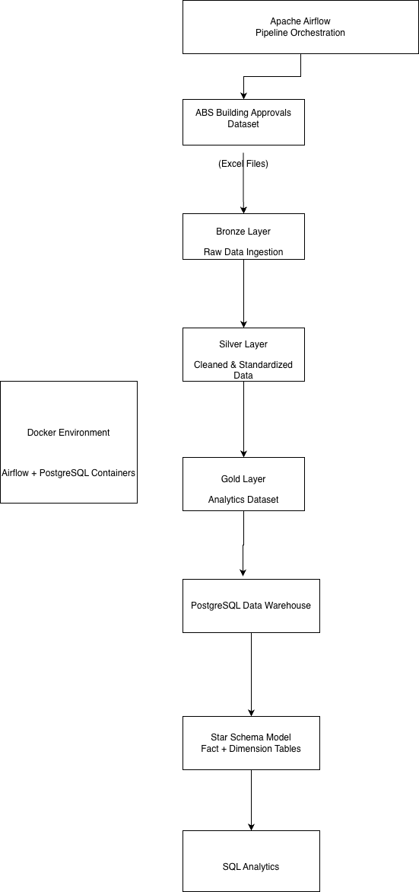
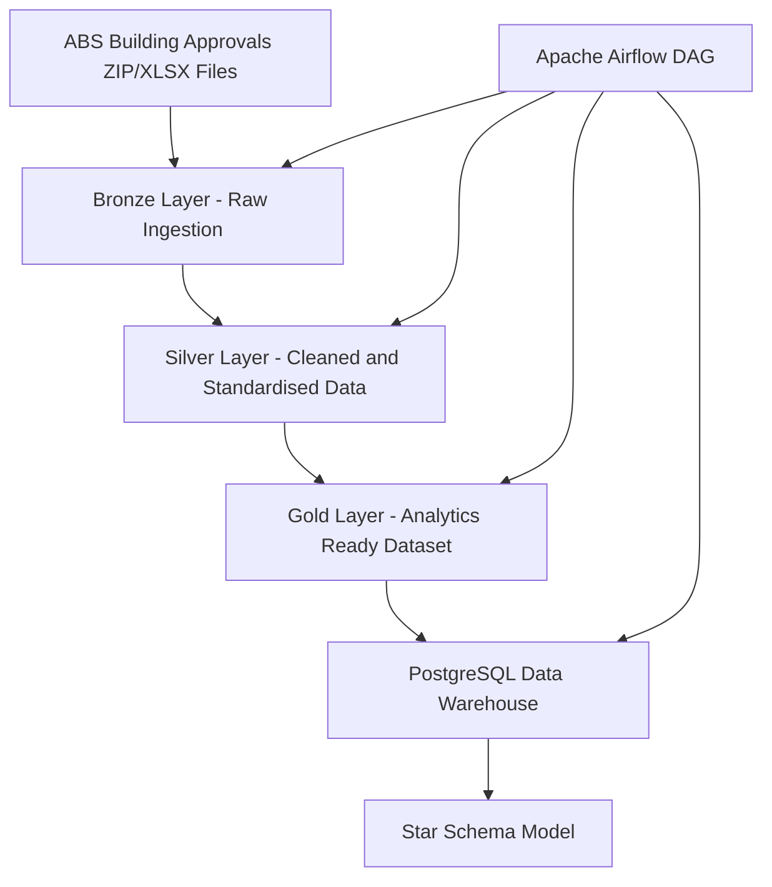

# Aussie Property Lakehouse Pipeline

An end-to-end data engineering pipeline that processes Australian Bureau of Statistics building approvals datasets using Python, Apache Airflow, Docker and PostgreSQL.

The pipeline implements a layered Bronze–Silver–Gold architecture and loads curated datasets into a PostgreSQL data warehouse with a star schema model for analytics.
This project is an end-to-end batch data engineering pipeline built around Australian Bureau of Statistics building approvals data.

It ingests raw ABS Excel files, processes them through Bronze, Silver, and Gold layers, performs data quality checks, and loads the final curated dataset into PostgreSQL. The workflow is orchestrated with Apache Airflow and runs in Docker.

## Architecture



## Airflow DAG


## Tech Stack

- Python
- Pandas
- PostgreSQL
- Apache Airflow
- Docker
- SQLAlchemy
- openpyxl

## Data Source

Australian Bureau of Statistics building approvals dataset distributed as Excel workbooks.

## Pipeline Layers

### Bronze
Raw ABS files ingested with minimal modification.

### Silver
Cleaned and standardised intermediate dataset.

### Gold
Curated analytics-ready dataset prepared for warehouse loading.

## Data Warehouse Model

The warehouse layer includes:

### Dimension Tables
- dim_year
- dim_state
- dim_dwelling_type
- dim_sector

### Fact Table
- fact_building_approvals

## Project Structure

```text
aussie-property-lakehouse/
├── airflow/
├── dags/
├── data/
│   ├── raw/
│   ├── bronze/
│   ├── silver/
│   └── gold/
├── src/
│   ├── etl/
│   ├── ingestion/
│   ├── quality/
│   ├── pipeline/
│   └── transform/
├── tests/
├── docker-compose.yml
└── README.md
```

## How to Run

Start PostgreSQL:

```bash
docker compose up -d
```

Start Airflow from the airflow directory:

```bash
cd airflow
docker compose up -d
```

Open Airflow UI:

```text
http://localhost:8081
```

Run the DAG:

```text
abs_building_approvals_pipeline
```

## Validation

Final warehouse table:

```sql
SELECT COUNT(*) FROM building_approvals_gold_batch;
```

Current result:

```text
474
```
## Example Query

Example analytics query on the warehouse:

```sql
SELECT
    s.state_name,
    COUNT(*) AS approvals
FROM fact_building_approvals f
JOIN dim_state s
ON f.state_id = s.state_id
GROUP BY s.state_name
ORDER BY approvals DESC;
## Summary

This project demonstrates a practical batch data engineering workflow using Airflow, Docker, PostgreSQL, and layered transformations. It also includes a simple warehouse model with fact and dimension tables for downstream SQL analysis.
