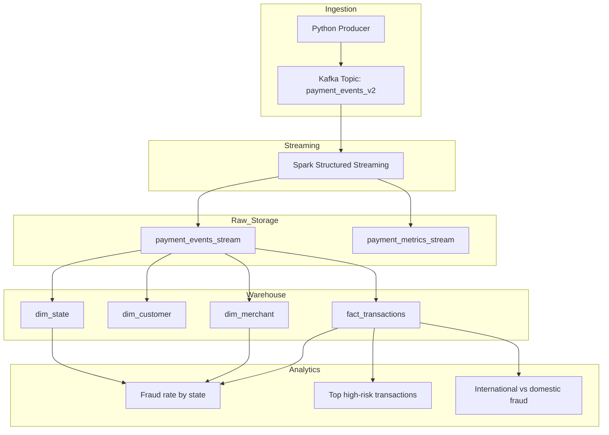

# Real-Time Fintech Fraud Detection Streaming Pipeline

An end-to-end real-time data engineering project that simulates payment transactions, streams them through Kafka, processes them using Spark Structured Streaming, and stores results in PostgreSQL for fraud analytics.

This project demonstrates how modern data platforms process **high-volume financial transactions in real time** and detect suspicious activities using rule-based fraud detection.

---

## Project Goal

The objective of this project is to build an advanced streaming data platform that demonstrates:

- real-time transaction event generation
- Kafka-based event ingestion
- Spark Structured Streaming transformation
- data quality validation
- PostgreSQL warehouse loading
- SQL-based analytics on streaming data
# Real-Time Fintech Fraud Streaming Pipeline

This project simulates a real-time payment fraud detection pipeline using Kafka, Spark Structured Streaming, and PostgreSQL.

## Architecture


## Target Scale

- 10,000+ streaming events
- multi-attribute transaction records
- real-time ingestion and processing
- persistent storage for SQL analytics

## Planned Architecture

```text
Transaction Generator
      ↓
Kafka Producer
      ↓
Kafka Topic
      ↓
Spark Structured Streaming
      ↓
Validation / Fraud Rules
      ↓
PostgreSQL Warehouse
      ↓
SQL Analytics
```
## Project Structure

```
real-time-fintech-fraud-pipeline
│
├── docker
│   └── docker-compose.yml
│
├── src
│   ├── producer
│   │   └── event_producer.py
│   │
│   └── streaming
│       └── spark_streaming_consumer.py
│
├── sql
│   ├── create_tables.sql
│   └── analytics_queries.sql
│
├── docs
│   └── architecture.md
│
├── README.md
└── requirements.txt
```
## Sample Analytics Results

### Fraud Rate by State

| State | Total Transactions | Fraud Transactions | Fraud Rate |
|------|------|------|------|
| WA | 33199 | 8906 | 0.2683 |
| SA | 33032 | 8720 | 0.2640 |
| QLD | 33570 | 8839 | 0.2633 |
| NSW | 33219 | 8747 | 0.2633 |
| VIC | 33244 | 8696 | 0.2616 |
| TAS | 33513 | 8750 | 0.2611 |

### Fraud Category Distribution

| Fraud Type | Total Transactions | Percentage |
|------|------|------|
| NORMAL | 147119 | 73.64% |
| HIGH_AMOUNT | 39592 | 19.82% |
| INTERNATIONAL | 12340 | 6.18% |
| HIGH_RISK | 726 | 0.36% |

## Performance Benchmark

This streaming pipeline processes simulated financial transactions in real time.

**Pipeline Performance**

- Total streaming events processed: **200,000+**
- Streaming processing engine: **Spark Structured Streaming**
- Message broker: **Apache Kafka**
- Data warehouse: **PostgreSQL**

**System Capabilities**

- Real-time fraud transaction detection
- Streaming data ingestion from Kafka
- Continuous processing with Spark Structured Streaming
- Data warehousing using a star schema model
- SQL analytics for fraud monitoring

**Key Technologies**

- Apache Kafka
- Apache Spark Structured Streaming
- PostgreSQL
- Docker
- Python
## Tech Stack

- Python
- Apache Kafka
- Apache Spark Structured Streaming
- Docker
- PostgreSQL
- SQLAlchemy

## Example Event Model

```json
{
  "event_id": "uuid",
  "event_ts": "2026-03-08T05:12:11Z",
  "transaction_id": "TXN123456",
  "customer_id": 102938,
  "merchant_id": 48392,
  "merchant_category": "groceries",
  "payment_method": "card",
  "currency": "AUD",
  "amount": 128.45,
  "state": "VIC",
  "channel": "mobile_app",
  "device_type": "ios",
  "transaction_status": "approved",
  "is_international": false,
  "risk_score": 0.13
}
```

## Project Structure

```text
kafka-streaming-pipeline/
├── README.md
├── requirements.txt
├── docker/
│   └── docker-compose.yml
├── src/
│   ├── producer/
│   ├── streaming/
│   ├── warehouse/
│   ├── quality/
│   └── utils/
├── data/
│   ├── raw/
│   └── checkpoints/
├── docs/
│   └── architecture/
└── sql/
    └── init.sql
```
---

## Fraud Detection Logic

Fraud classification is implemented using rule-based logic inside the Spark Structured Streaming job.

Rules include:

- HIGH_RISK → risk_score > 0.8
- HIGH_AMOUNT → transaction amount > 4000 AUD
- INTERNATIONAL → transaction marked as international
- NORMAL → all other transactions

This simulates a simplified real-world fraud detection engine used by fintech companies.

---

## Example Fraud Analytics Queries

### Fraud Rate by State

```sql
SELECT
    state,
    COUNT(*) AS total_transactions,
    SUM(CASE WHEN fraud_flag <> 'NORMAL' THEN 1 ELSE 0 END) AS fraud_transactions,
    ROUND(
        SUM(CASE WHEN fraud_flag <> 'NORMAL' THEN 1 ELSE 0 END)::numeric / COUNT(*),
        4
    ) AS fraud_rate
FROM fact_transactions
GROUP BY state
ORDER BY fraud_rate DESC;
###International vs Domestic Fraud
SELECT
    is_international,
    COUNT(*) AS total_transactions,
    SUM(CASE WHEN fraud_flag <> 'NORMAL' THEN 1 ELSE 0 END) AS fraud_transactions,
    ROUND(
        SUM(CASE WHEN fraud_flag <> 'NORMAL' THEN 1 ELSE 0 END)::numeric / COUNT(*),
        4
    ) AS fraud_rate
FROM fact_transactions
GROUP BY is_international;
Key Engineering Highlights
	Built an end-to-end streaming data pipeline
	Processed 200,000 simulated payment transactions
	Implemented Kafka event ingestion
	Implemented Spark Structured Streaming transformations
	Designed a star schema warehouse model
	Built analytical SQL fraud detection queries
	Handled duplicate key conflicts and streaming batch writes
## Status

Project setup in progress.

Next step:
- implement a Kafka producer for real-time transaction events
